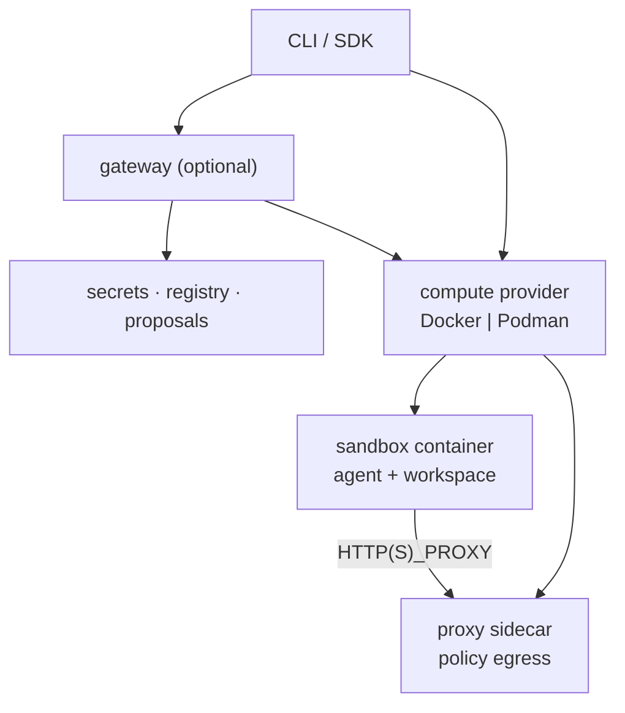

<!--
SPDX-FileCopyrightText: Copyright (c) 2026 whaleshell
SPDX-License-Identifier: MIT
-->

# Architecture

## Planes

| Plane | Components |
|-------|------------|
| Control | CLI, gateway HTTP API, encrypted secrets, proposals |
| Data | Sandbox container, workspace bind, agent process |
| Enforcement | Proxy sidecar, Landlock/seccomp via `whaleshell-init` |

## Create path

1. CLI resolves image, policy, providers, soft defaults.
2. Driver ensures Engine images (sandbox + slim proxy).
3. Driver creates internal network, proxy, sandbox, volumes.
4. Gateway registers the sandbox when configured.
5. Guest traffic uses `HTTP(S)_PROXY` toward the sidecar.

## Modules

| Module | Role |
|--------|------|
| `whaleshell-cli` | User CLI |
| `whaleshell-core` | Policy schema + engine |
| `whaleshell-driver` | Docker / Podman / stubs |
| `whaleshell-proxy` | Egress sidecar + `policy.local` |
| `whaleshell-gateway` | Control plane |
| `whaleshell-runtime` | Init, images, agent helpers |
| `whaleshell-providers` | Credential profiles |
