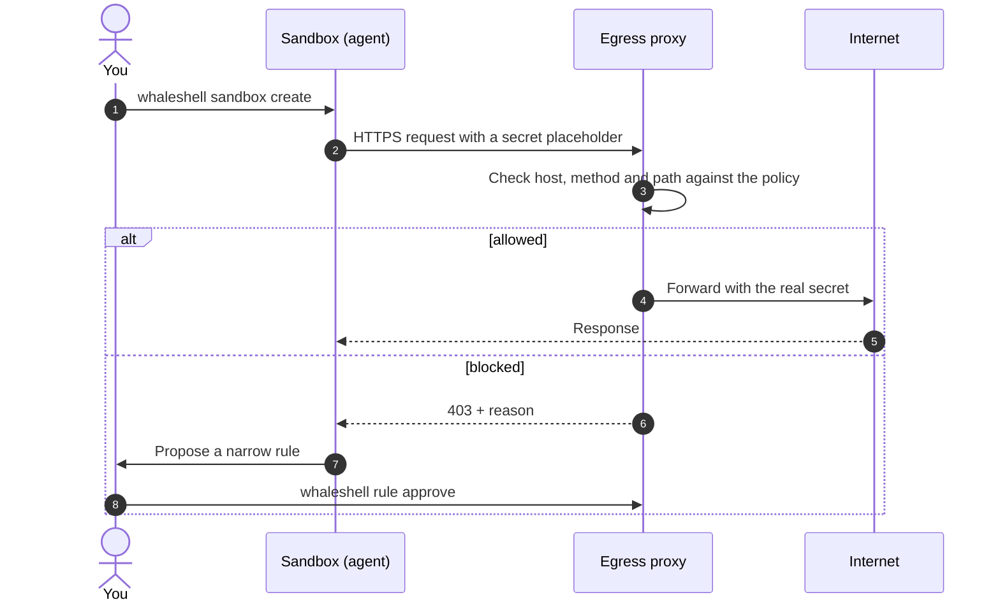

---
hide:
  - navigation
  - toc
---

<!--
SPDX-FileCopyrightText: Copyright (c) 2026 whaleshell
SPDX-License-Identifier: MIT
-->

# whaleshell

Policy-bound sandboxes for coding agents. 
Cursor, Claude, Codex — or anything you bring — on Docker or Podman.

[Get started](get-started/index.md){ .md-button .md-button--primary }
[Providers](providers/index.md){ .md-button }

## Why

Coding agents run shell commands, install packages and call APIs for you. Run
them straight on your machine and they get your whole home directory, SSH
keys, cloud credentials and an open internet connection. One bad prompt or
poisoned package is enough to leak or break something.

whaleshell runs the agent in a container that sees **only your project** and
can reach **only the hosts you allow**. Secrets stay outside the container.

-   :material-folder-lock:{ .lg .middle } __Only the project__

    ---

    Your folder is mounted at `/workspace`. No `docker.sock`, no `~/.ssh`,
    no `~/.aws` inside.

-   :material-wall-fire:{ .lg .middle } __Default-deny network__

    ---

    Nothing leaves the sandbox unless the policy allows the host — and for
    HTTPS, the method and path.

-   :material-key-chain:{ .lg .middle } __Secrets stay outside__

    ---

    The agent sees placeholders. Real tokens are added by the proxy, only on
    allowed requests.

-   :material-sync:{ .lg .middle } __Live policy__

    ---

    The agent proposes a narrow rule, you approve it, the proxy reloads in
    about a second — no rebuild.

-   :material-robot-outline:{ .lg .middle } __Any agent__

    ---

    Ready images for Cursor, Claude and Codex, or bring your own container.

-   :material-docker:{ .lg .middle } __Docker or Podman__

    ---

    Same layout on both engines; Kubernetes and MicroVM are on the way.

## How it works

1. **Create.** `whaleshell sandbox create` starts two containers on a private
   network: the sandbox with the agent and your workspace, and an egress proxy
   next to it.
2. **Every request goes through the proxy.** The sandbox has no other way out,
   so all traffic is checked against your policy.
3. **Secrets are swapped on the way out.** The agent only ever holds
   placeholders like `whaleshell:resolve:env:GITHUB_TOKEN`; the proxy puts the
   real token into requests the policy allows.
4. **Blocked means explained.** A denied request gets a 403 with the reason, so
   the agent can ask for exactly the access it needs.
5. **You stay in control.** Approve or reject the proposal; the new policy is
   live in about a second, without recreating the sandbox.

More detail: [Architecture](concepts/architecture.md) · [Security](concepts/security.md).

## Explore

-   :material-rocket-launch:{ .lg .middle } __Get started__

    ---

    Install, start the engine and gateway, create a sandbox — step by step.

    [:octicons-arrow-right-24: Get started](get-started/index.md)

-   :material-server-network:{ .lg .middle } __Providers__

    ---

    Docker and Podman today; Kubernetes and MicroVM coming soon.

    [:octicons-arrow-right-24: Providers](providers/index.md)

-   :material-shield-lock:{ .lg .middle } __Policy__

    ---

    Allowlists, L7 rules, proposals and approve.

    [:octicons-arrow-right-24: Policy guide](guides/policy.md)

